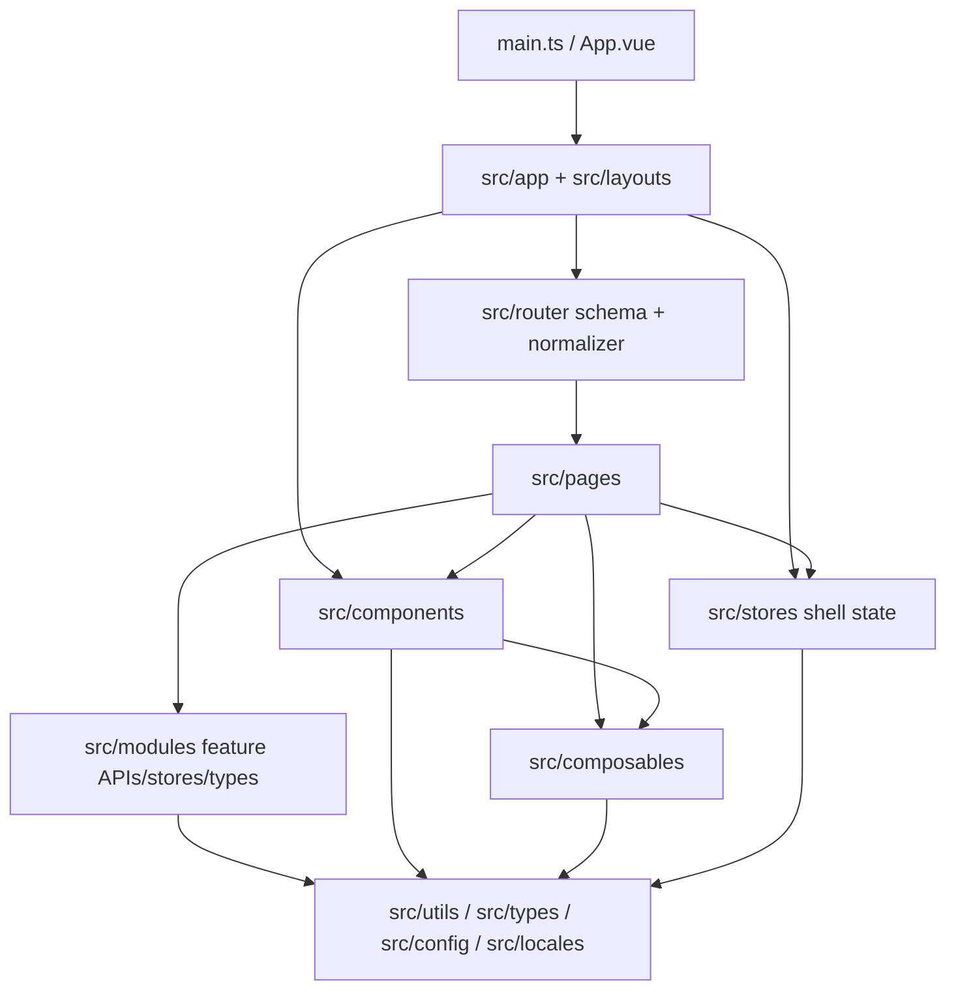

# MealMate Web Architecture

Last updated: 2026-04-25

本文件记录 `mealmate-web` 的当前架构事实、分层边界与依赖方向。它回答“仓库如何组织、长期边界是什么”，不记录单次功能计划。

## 1. 系统定位

MealMate Web 是一个 schema 驱动的 Vue 3 前端应用。它负责 MealMate 家庭饮食规划场景的 Web 页面承载、交互编排、布局 shell、前端状态与 API 调用入口。

当前架构目标是让页面、菜单、Tabs、KeepAlive、响应式布局和业务模块围绕同一套路由与组件协议协同演进，而不是在页面组件中各自实现壳层逻辑。

不属于本仓库职责：

- 后端服务、数据库迁移、任务调度和认证服务实现
- MealMate 业务算法的服务端编排
- 与当前 Web 壳层无关的独立页面集合

## 2. 技术基线

| 领域       | 当前选择                                           |
| ---------- | -------------------------------------------------- |
| 应用框架   | Vue 3, Composition API, `<script setup lang="ts">` |
| 构建与类型 | Vite, TypeScript, vue-tsc                          |
| 路由与状态 | Vue Router, Pinia, pinia-plugin-persistedstate     |
| UI 与交互  | Element Plus, VueUse, Sass                         |
| 国际化     | Vue I18n, Element Plus locale                      |
| 请求       | Axios, `src/utils/api/*`                           |
| 验证       | ESLint, Vitest, Playwright                         |

## 3. 目录职责

| 路径                            | 职责                                                        |
| ------------------------------- | ----------------------------------------------------------- |
| `src/main.ts`, `src/App.vue`    | 应用启动、插件注册与根组件挂载                              |
| `src/app/`                      | 应用壳层渲染编排，如 layout 解析、页面承载、缓存 key        |
| `src/layouts/`                  | 布局骨架、头部、侧边栏、页签与响应式 shell                  |
| `src/router/`                   | 路由 schema、标准化、树结构、Vue Router records 与类型协议  |
| `src/stores/`                   | 跨页面壳层状态，如菜单、Tabs、KeepAlive、响应式布局         |
| `src/pages/`                    | 页面级组件，由路由 schema 承载，负责页面编排                |
| `src/modules/`                  | 业务模块边界，按领域组织 API、store、types、constants、mock |
| `src/components/`               | 通用组件、业务复用组件与协议化渲染单元                      |
| `src/composables/`              | 可复用组合式逻辑与局部交互状态                              |
| `src/utils/`                    | API 基础设施、消息、初始化与纯工具函数                      |
| `src/config/`, `src/constants/` | 环境配置与跨层常量                                          |
| `src/locales/`                  | i18n 配置与语言资源                                         |
| `src/types/`                    | 全局类型、自动导入类型和跨模块共享类型                      |
| `tests/`                        | 单元测试、E2E 测试、页面对象与测试 setup                    |
| `docs/`                         | Harness、产品语义、组件协议、计划和运行质量文档             |

## 4. 路由与 Shell 协议

页面入口由 `src/router/app-route-schema.ts` 统一声明。`src/router/route-normalizer.ts` 为每个 route 补齐默认的 layout、menu、tab、keepAlive 元信息，`src/router/app-routes.ts` 再把 schema 转成 Vue Router records。

当前关键事实：

- 页面组件文件位于 `src/pages/*.vue`，并通过 schema 的 `component` 字段解析。
- 页面标题优先通过 `route.meta.title` 管理，菜单和页签复用同一份 route meta。
- layout 选择由 `src/app/shell/AppLayoutRenderer.vue` 根据 `route.meta.layout` 决定。
- 页面承载、KeepAlive include 列表、刷新 key 和缓存失效由 `src/app/shell/AppPageRenderer.vue` 与相关 store 统一组织。
- 新增页面时，先判断菜单可见性、页签行为、缓存策略和移动端壳层表现，再补 schema、页面与测试。

这套协议的目的，是让导航、Tabs、缓存和响应式布局围绕同一份路由事实工作。

## 5. 分层模型



## 6. 依赖方向

允许的主要依赖关系：

- `main/App -> app, router, stores, locales, assets`
- `app -> layouts, router, stores`
- `layouts -> stores, components, composables`
- `router -> pages`，仅通过 route schema 与 `import.meta.glob` 解析页面入口
- `pages -> modules, components, composables, stores, utils`
- `modules -> utils/api, types, constants`
- `components -> composables, utils, types`
- `stores -> utils, constants, types`

默认避免：

- 页面绕开路由 schema 手工装配菜单、Tabs、KeepAlive 或 layout。
- `layouts` 承载页面业务流程或直接调用业务模块 API。
- `router` 依赖具体业务模块内部实现。
- `src/stores` 写页面级临时逻辑；页面局部状态优先放在页面或 composable。
- `src/modules` 依赖 `pages`、`layouts` 或 `router`。
- `utils` 依赖页面上下文、组件实例或业务模块状态。

## 7. 层级边界

### `app`

负责应用 shell 的渲染编排和上下文协调，不承载业务规则。

### `layouts`

负责导航、页签、头部、侧边栏与响应式布局骨架，不直接写页面业务流程。

### `router`

负责页面入口、route meta 默认值、菜单树输入和 Vue Router records。新增页面必须从 schema 进入系统。

### `pages`

负责页面编排，保持相对瘦身；复杂加载、表单、筛选和提交流程优先下沉到模块、组件、composable 或 store。

### `modules`

负责业务领域内聚。一个模块可以包含 `api.ts`、`store.ts`、`types.ts`、`constants.ts`、`mock.ts` 等文件，但不拥有全局 shell 规则。

### `components`

负责可复用展示与交互单元。通用协议组件的字段、事件和插槽契约维护在 `docs/components/`。

### `composables`

负责页面内或跨组件可复用的交互逻辑与局部状态组织；若状态需要跨页面长期同步，应考虑提升到 store 或业务模块。

### `stores`

负责菜单、Tabs、KeepAlive、响应式壳层状态与真正跨页面共享的数据。业务模块私有 store 优先放在对应 `src/modules/{domain}/` 下。

### `utils`

负责纯函数、API 请求基础设施和通用工具，不承载依赖具体页面上下文的流程逻辑。

## 8. 数据流

默认页面数据链路：

```text
Route schema -> Shell renderer -> Page -> Module API/Store or Composable -> utils/api -> Backend -> UI
```

职责要求：

- route schema 负责页面入口、标题、布局、菜单、页签与缓存策略。
- shell renderer 负责 layout 和页面承载，不关心具体业务。
- page 负责业务页面编排和用户交互入口。
- module API/store 负责业务数据读写、mock 数据和领域类型。
- composable 负责可复用交互与局部状态组织。
- API 请求基础设施优先复用 `src/utils/api/request.ts`、`src/utils/api/http.ts`。

## 9. 测试边界

- 路由 schema、normalizer、路由树和 shell 同步规则应有单元测试覆盖。
- layout、Tabs、KeepAlive、响应式壳层状态变化应优先补单元测试。
- 通用组件协议变化必须同步 `docs/components/` 与对应组件单测。
- 新增页面或关键用户路径至少补充与风险匹配的 E2E 或页面对象断言。
- 业务模块 API、store、类型转换或 mock 约定变化时，优先补模块级单测。

## 10. 关键约束

- 页面标题、菜单标题、页签标题必须围绕统一 route meta 保持一致。
- 新增页面先注册 schema，再处理页面组件、业务模块、导航语义和测试。
- 路由、layout、Tabs、KeepAlive 和响应式逻辑优先走现有 normalizer、shell 与 store，不另起约定。
- 组件不直接硬编码业务常量，除非它本身就是该领域的业务组件。
- 长期架构变化应同步本文件；单次实现方案和阶段计划放入 `docs/active/{requirement}/`。

## 11. 相关文档

- 前端实现约束：`docs/FRONTEND.md`
- Harness 分层与验收：`docs/HARNESS.md`
- 业务语义与范围：`docs/PRODUCT_SENSE.md`
- 组件协议：`docs/components/`
- 计划机制：`docs/guides/PLANS.md`, `docs/active/`, `docs/archive/`
