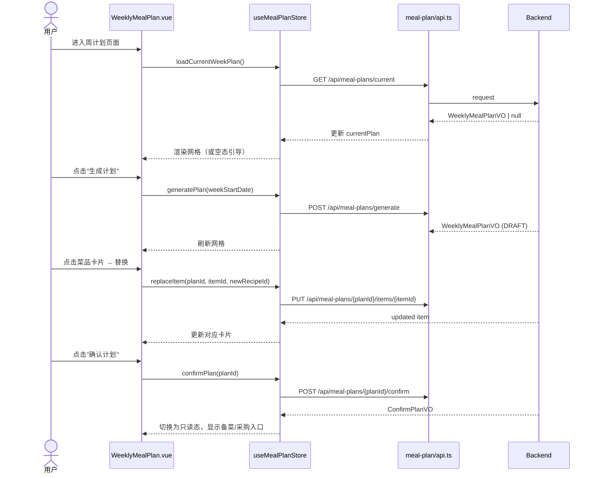

# 设计文档：UC3 生成周计划（前端）

## 背景

后端提供周计划生成、调整、确认及派生备菜/采购的 API，前端需新增周计划页面（7×3 网格）、备菜计划页面和采购清单页面，承载完整的计划生成与执行交互。

## 技术方案

### 路由注册

```ts
// src/router/app-route-schema.ts 新增
{ name: 'WeeklyMealPlan', path: '/weekly-meal-plan', title: '周计划', icon: 'Calendar', component: 'weekly-meal-plan' }
{ name: 'PrepPlan', path: '/prep-plan', title: '备菜计划', icon: 'List', component: 'prep-plan' }
{ name: 'ShoppingList', path: '/shopping-list', title: '采购清单', icon: 'ShoppingCart', component: 'shopping-list' }
```

### 模块结构

```
src/modules/meal-plan/
├── components/
│   ├── WeekNavigator.vue          # 周选择器（前后翻页）
│   ├── WeekCalendarGrid.vue       # 7×3 网格主视图
│   ├── MealItemCard.vue           # 单菜品卡片
│   ├── ReplaceRecipeDrawer.vue    # 替换菜品抽屉
│   ├── ManualAddDrawer.vue        # 手动添加菜名抽屉
│   └── PlanActionBar.vue          # 底部操作栏
├── composables/
│   ├── useWeeklyPlan.ts           # 加载、生成、确认
│   ├── useReplaceItem.ts          # 替换逻辑
│   └── useManualAdd.ts            # 手动添加逻辑
├── api.ts                         # API 调用
├── types.ts                       # TypeScript 类型
├── constants.ts                   # 枚举常量
└── store.ts                       # useMealPlanStore

src/modules/prep/
├── components/
│   ├── PrepTaskList.vue           # 备菜任务列表
│   └── ShoppingItemList.vue       # 采购清单列表
├── composables/
│   ├── usePrepPlan.ts
│   └── useShoppingList.ts
├── api.ts
└── types.ts
```

### 页面组件

| 页面文件 | 职责 |
|----------|------|
| `src/pages/weekly-meal-plan.vue` | 周计划主页面编排 |
| `src/pages/prep-plan.vue` | 备菜计划页面 |
| `src/pages/shopping-list.vue` | 采购清单页面 |

### 核心交互流程



### 组件设计要点

| 组件 | 桌面端 | 移动端 |
|------|--------|--------|
| WeekCalendarGrid | 7列×3行网格 | 单日视图+左右滑动切换 |
| MealItemCard | 卡片含封面缩略图、菜名、标签 | 操作按钮常驻（≥44×44px） |
| ReplaceRecipeDrawer | 侧边抽屉 | 全屏抽屉，搜索框固定顶部 |
| PlanActionBar | 页面底部操作栏 | 固定底部+safe-area-inset-bottom |

### 状态管理

`useMealPlanStore` (Pinia)：
- `currentPlan: WeeklyMealPlanVO | null` — 当前展示的计划
- `loading: boolean` — 加载/生成中状态
- `selectedWeekStart: string` — 当前选中的周起始日期

业务模块私有 store，放在 `src/modules/meal-plan/store.ts`。

## 影响范围

| 模块/文件 | 变更类型 | 说明 |
|-----------|----------|------|
| src/router/app-route-schema.ts | 修改 | 注册 3 个新路由 |
| src/pages/weekly-meal-plan.vue | 新增 | 周计划页面 |
| src/pages/prep-plan.vue | 新增 | 备菜计划页面 |
| src/pages/shopping-list.vue | 新增 | 采购清单页面 |
| src/modules/meal-plan/ | 新增 | 周计划业务模块 |
| src/modules/prep/ | 新增 | 备菜/采购业务模块 |
| src/locales/zh-CN/meal-plan.json | 新增 | i18n 资源 |
| src/locales/en-US/meal-plan.json | 新增 | i18n 资源 |

## 约束

- 页面标题使用"周计划"、"备菜计划"、"采购清单"
- 遵循现有 route schema + normalizer 协议注册页面
- 新模块不依赖 pages、layouts、router 内部实现
- 移动端核心页面必须做视口检查

## 验证方式

- **Store 单测**：generatePlan、replaceItem、confirmPlan 的状态变更
- **组件测试**：MealItemCard 重复警告渲染、PlanActionBar 状态切换
- **E2E**：生成→替换→确认→进入备菜页完整流程
