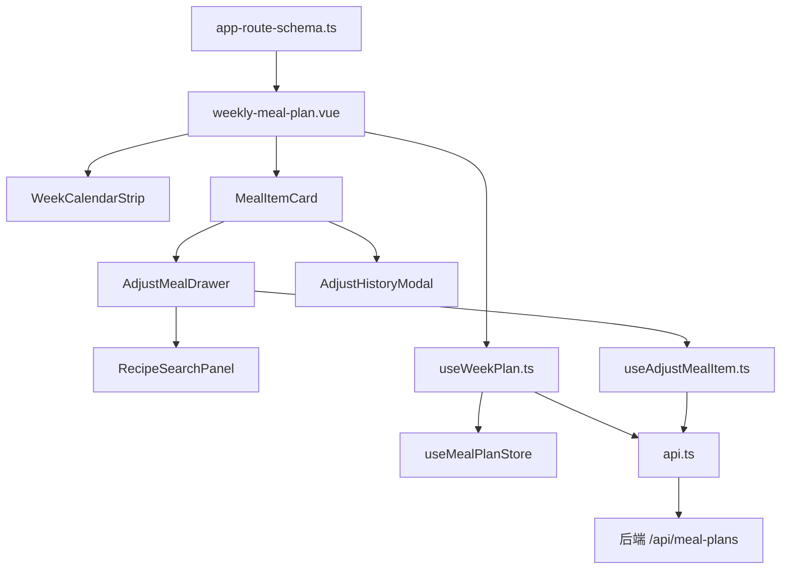

# UC4 Adjust Meal Item (Frontend) Design

## Background & Motivation

UC4 前端需在周计划页面上实现完整的调整餐次交互。由于 UC3 前端页面骨架尚未实现，本轮一并搭建周计划页面（路由 + 页面 + 模块目录），再叠加 UC4 的调整抽屉、推荐、搜索和历史弹窗。

## Goal

- 周计划页面可通过菜单导航访问
- 调整交互完整闭环：打开抽屉 → 推荐/搜索 → 确认 → 卡片刷新
- 搜索输入 300ms 防抖，无冗余请求
- 移动端交互可用（触控区域 ≥ 44px，抽屉底部弹出）

## Non-Goal

- UC3 生成计划、确认计划流程
- 备菜计划/采购清单页面
- 拖拽排序餐次
- 离线缓存/PWA

## Architecture



数据流：
1. 页面加载 → useWeekPlan 调 `getCurrentWeekPlan()` → store 缓存 plan
2. 点击换一换 → Drawer open → useAdjust 调 `getRecommendRecipes(planId, itemId)` → 展示列表
3. 确认替换 → useAdjust 调 `adjustMealItem(...)` → 成功 → emit('adjusted') → 页面刷新卡片
4. 查看历史 → HistModal open → useAdjust 调 `getItemHistory(planId, itemId)` → 展示列表

## Interface Contract

### API 函数签名 (`src/modules/meal-plan/api.ts`)

```typescript
// 获取当前周计划
export function getCurrentWeekPlan(params?: { weekStartDate?: string }): Promise<WeeklyMealPlan>

// 获取指定计划详情
export function getWeekPlan(planId: number): Promise<WeeklyMealPlan>

// 替换餐次菜品
export function adjustMealItem(
  planId: number,
  itemId: number,
  body: { newRecipeId: number; adjustReason?: AdjustReason }
): Promise<MealPlanItem>

// 获取推荐菜品列表
export function getRecommendRecipes(planId: number, itemId: number): Promise<RecipeBrief[]>

// 获取调整历史
export function getItemHistory(planId: number, itemId: number): Promise<MealPlanItemHistory[]>

// 搜索菜品（复用已有 Recipe 模块接口 GET /api/recipes/search）
export function searchRecipes(keyword: string): Promise<RecipeBrief[]>
```

### 类型定义 (`src/modules/meal-plan/types.ts`)

```typescript
export type MealType = 'BREAKFAST' | 'LUNCH' | 'DINNER'
export type CrowdType = 'ALL' | 'ADULT' | 'BABY'
export type PlanStatus = 'DRAFT' | 'CONFIRMED' | 'ARCHIVED'
export type AdjustReason = 'LACK_INGREDIENT' | 'TASTE_CHANGE' | 'OUTING' | 'OTHER'

export interface WeeklyMealPlan {
  planId: number
  weekStartDate: string
  weekEndDate: string
  status: PlanStatus
  dayMeals: Record<string, DayMeal> // key: yyyy-MM-dd
}

export interface DayMeal {
  date: string
  breakfast: MealPlanItem[]
  lunch: MealPlanItem[]
  dinner: MealPlanItem[]
}

export interface MealPlanItem {
  itemId: number
  recipeId: number
  recipeName: string
  crowdType: CrowdType
  mealType: MealType
  weightLoss: boolean
  manuallyAdjusted: boolean
  adjustCount: number
  coverImageUrl?: string
  cookTimeMinutes?: number
}

export interface RecipeBrief {
  recipeId: number
  name: string
  recipeType: string
  seasonTag: string
  coverImageUrl?: string
  cookTimeMinutes?: number
}

export interface MealPlanItemHistory {
  historyId: number
  oldRecipeName: string
  newRecipeName: string
  adjustReason: string | null
  adjustedAt: string
}
```

### 组件 Props/Emits

| 组件 | Props | Emits |
|------|-------|-------|
| MealItemCard | `item: MealPlanItem` | `@adjust(itemId)`, `@history(itemId)` |
| AdjustMealDrawer | `visible: boolean`, `planId: number`, `itemId: number` | `@close`, `@adjusted(item: MealPlanItem)` |
| RecipeSearchPanel | — | `@select(recipe: RecipeBrief)` |
| AdjustHistoryModal | `visible: boolean`, `planId: number`, `itemId: number` | `@close` |
| WeekCalendarStrip | `currentWeek: string` | `@change(weekStartDate: string)` |

## Non-Functional Requirements

| 维度 | 指标 |
|------|------|
| 性能 | 搜索防抖 300ms；推荐列表首屏 < 500ms |
| 响应式 | PC: 抽屉右侧 400px；Mobile(<768px): 底部弹出 90% |
| 可访问性 | 按钮触控区域 ≥ 44×44px |
| Bundle | 不引入新依赖，使用 Element Plus 现有组件 |

## Error Handling

| 场景 | 处理策略 |
|------|----------|
| 推荐列表请求失败 | 展示错误提示 + 重试按钮 |
| 替换请求 400 RECIPE_DUPLICATE_IN_WEEK | ElMessage.warning("该菜品本周已使用") |
| 替换请求 400 MEAL_PLAN_FROZEN | ElMessage.error("计划已锁定，无法调整") |
| 替换请求 500 | ElMessage.error("操作失败，请重试") |
| 搜索无结果 | 展示"未找到匹配菜品" |

## Alternatives Considered

| 方案 | 优点 | 缺点 | 不选原因 |
|------|------|------|----------|
| 调整用 Dialog 而非 Drawer | 实现简单 | 移动端体验差，内容空间受限 | Drawer 更适合列表选择场景 |
| 推荐/搜索用同一个列表 | 少一个 Tab | 两种数据源混排体验差 | 分 Tab 逻辑更清晰 |
| 全局 store 管理调整状态 | 跨组件方便 | 调整是局部交互，不需要跨页面 | composable 更轻量 |

## Testing Strategy

| 测试对象 | 层级 | 关键用例 |
|----------|------|----------|
| useAdjustMealItem | 单元(Vitest) | 推荐加载、替换提交成功/失败、防抖 |
| useWeekPlan | 单元(Vitest) | 加载计划、周切换 |
| MealItemCard | 组件(Vitest) | 角标渲染（adjustCount>0 显示）、emit adjust |
| AdjustMealDrawer | 组件(Vitest) | 打开时触发推荐请求、选中+确认流程 |
| 完整替换流程 | E2E(Playwright) | 打开抽屉→选菜品→确认→卡片刷新→角标出现 |
