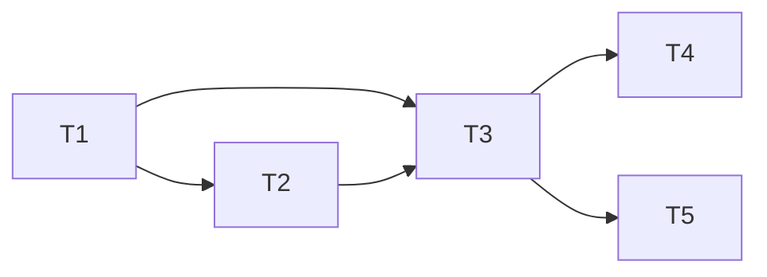

# UC4 Adjust Meal Item (Frontend) Implementation Plan

**Goal:** 搭建周计划页面骨架 + 实现调整餐次菜品完整交互
**Architecture:** 新增 meal-plan 业务模块（types/api/store/composables/components），注册路由，页面编排调整抽屉和历史弹窗
**Tech Stack:** Vue 3 + TypeScript + Element Plus + Pinia + VueUse

## Dependency Graph



| Task | 依赖 | 可并行组 |
|------|------|---------|
| T1: types + api + mock | 无 | A |
| T2: composables | T1 | B |
| T3: 页面骨架 + 基础组件 | T1, T2 | C |
| T4: 调整抽屉 + 搜索面板 | T3 | D |
| T5: 历史弹窗 | T3 | D |

---

### Task 1: types + api + mock + store

**Depends on:** 无
**Files:**
- Create: `src/modules/meal-plan/types.ts`
- Create: `src/modules/meal-plan/api.ts`
- Create: `src/modules/meal-plan/mock.ts`
- Create: `src/modules/meal-plan/store.ts`
- Test: `tests/unit/modules/meal-plan/api.test.ts`

**Behavior:** 定义所有类型、API 函数和 mock 数据，useMealPlanStore 管理当前周计划。

- [ ] **Step 1: Write failing test**

```typescript
// api.test.ts
import { describe, it, expect, vi } from 'vitest'
import { adjustMealItem } from '@/modules/meal-plan/api'

describe('meal-plan api', () => {
  it('adjustMealItem should call PUT with correct path', async () => {
    // mock http.put, 验证调用路径和参数
  })
})
```

- [ ] **Step 2: Implement**

types.ts: WeeklyMealPlan, DayMeal, MealPlanItem, RecipeBrief, MealPlanItemHistory, AdjustReason 等类型。
api.ts: getCurrentWeekPlan, getWeekPlan, adjustMealItem, getRecommendRecipes, getItemHistory, searchRecipes 六个函数。
mock.ts: 模拟数据（后端未就绪时开发用）。
store.ts: useMealPlanStore — currentPlan, loading, fetchCurrentWeekPlan, updateItem。

- [ ] **Step 3: Verify**

Run: `pnpm exec vitest run tests/unit/modules/meal-plan/`
Expected: PASS

- [ ] **Step 4: Commit**

```bash
git add src/modules/meal-plan/types.ts src/modules/meal-plan/api.ts src/modules/meal-plan/mock.ts src/modules/meal-plan/store.ts tests/unit/modules/meal-plan/
git commit -m "feat(meal-plan): 模块骨架 types/api/mock/store"
```

---

### Task 2: composables

**Depends on:** T1
**Files:**
- Create: `src/modules/meal-plan/composables/useWeekPlan.ts`
- Create: `src/modules/meal-plan/composables/useAdjustMealItem.ts`
- Test: `tests/unit/modules/meal-plan/composables/useAdjustMealItem.test.ts`

**Behavior:** useWeekPlan 封装周计划加载/切换；useAdjustMealItem 封装推荐加载、搜索防抖、替换提交、历史加载。

- [ ] **Step 1: Write failing test**

```typescript
// useAdjustMealItem.test.ts
describe('useAdjustMealItem', () => {
  it('should load recommend list on open', async () => {
    // 调用 openAdjust(planId, itemId) 后验证 recommendList 有值
  })
  it('should debounce search by 300ms', async () => {
    // 快速连续调用 search，验证 API 只调一次
  })
  it('should call adjustMealItem and emit result', async () => {
    // 调用 confirmAdjust 后验证 API 被调用
  })
})
```

- [ ] **Step 2: Implement**

```typescript
// useAdjustMealItem 关键逻辑：
//   1. openAdjust(planId, itemId) → 调 getRecommendRecipes → set recommendList
//   2. searchRecipes(keyword) → useDebounceFn(300ms) → 调搜索 API → set searchResults
//   3. confirmAdjust(newRecipeId, adjustReason?) → 调 adjustMealItem → return updatedItem
//   4. loadHistory(planId, itemId) → 调 getItemHistory → set historyList
```

- [ ] **Step 3: Verify**

Run: `pnpm exec vitest run tests/unit/modules/meal-plan/composables/`
Expected: PASS

- [ ] **Step 4: Commit**

```bash
git add src/modules/meal-plan/composables/ tests/unit/modules/meal-plan/composables/
git commit -m "feat(meal-plan): composables useWeekPlan + useAdjustMealItem"
```

---

### Task 3: 页面骨架 + 路由 + WeekCalendarStrip + MealItemCard

**Depends on:** T1, T2
**Files:**
- Modify: `src/router/app-route-schema.ts`
- Create: `src/pages/weekly-meal-plan.vue`
- Create: `src/modules/meal-plan/components/WeekCalendarStrip.vue`
- Create: `src/modules/meal-plan/components/MealItemCard.vue`
- Test: `tests/unit/modules/meal-plan/components/MealItemCard.test.ts`

**Behavior:** 注册 /weekly-meal-plan 路由；页面按天分组展示餐次卡片；MealItemCard 渲染菜品信息 + 已调整角标 + 换一换按钮。

- [ ] **Step 1: Write failing test**

```typescript
// MealItemCard.test.ts
describe('MealItemCard', () => {
  it('should show adjust badge when manuallyAdjusted', () => {
    // mount with item.manuallyAdjusted=true, item.adjustCount=2
    // expect badge visible with text "2"
  })
  it('should emit adjust event on button click', () => {
    // click 换一换 → expect emit('adjust', itemId)
  })
})
```

- [ ] **Step 2: Implement**

app-route-schema.ts: 新增 `{ path: '/weekly-meal-plan', name: 'WeeklyMealPlan', component: ... }` 含 meta.title="周计划"。
weekly-meal-plan.vue: 使用 useWeekPlan 加载数据，按天循环渲染 MealItemCard。
WeekCalendarStrip: 周选择器，emit change(weekStartDate)。
MealItemCard: 展示封面+菜名+角标+换一换按钮，emit adjust/history。

- [ ] **Step 3: Verify**

Run: `pnpm lint && pnpm type-check && pnpm exec vitest run tests/unit/modules/meal-plan/components/MealItemCard`
Expected: PASS

- [ ] **Step 4: Commit**

```bash
git add src/router/app-route-schema.ts src/pages/weekly-meal-plan.vue src/modules/meal-plan/components/WeekCalendarStrip.vue src/modules/meal-plan/components/MealItemCard.vue tests/unit/modules/meal-plan/components/
git commit -m "feat(meal-plan): 周计划页面骨架 + 路由 + 餐次卡片"
```

---

### Task 4: AdjustMealDrawer + RecipeSearchPanel

**Depends on:** T3
**Files:**
- Create: `src/modules/meal-plan/components/AdjustMealDrawer.vue`
- Create: `src/modules/meal-plan/components/RecipeSearchPanel.vue`
- Test: `tests/unit/modules/meal-plan/components/AdjustMealDrawer.test.ts`

**Behavior:** 抽屉含推荐 Tab + 搜索 Tab + 底部确认条；搜索面板 300ms 防抖；选中菜品 + 选择原因 + 确认 → emit adjusted。

- [ ] **Step 1: Write failing test**

```typescript
// AdjustMealDrawer.test.ts
describe('AdjustMealDrawer', () => {
  it('should fetch recommend on open', async () => {
    // mount with visible=true → expect getRecommendRecipes called
  })
  it('should emit adjusted after confirm', async () => {
    // select recipe → click confirm → expect emit('adjusted', item)
  })
})
```

- [ ] **Step 2: Implement**

AdjustMealDrawer: El-Drawer（PC direction="rtl" size="400px"，mobile direction="btt" size="90%"）。
内含 El-Tabs 切换推荐/搜索。底部固定确认条：选中菜品名 + 原因 El-Select + 确认按钮。
RecipeSearchPanel: El-Input + useDebounceFn + 结果列表。emit select(recipe)。

- [ ] **Step 3: Verify**

Run: `pnpm exec vitest run tests/unit/modules/meal-plan/components/AdjustMealDrawer`
Expected: PASS

- [ ] **Step 4: Commit**

```bash
git add src/modules/meal-plan/components/AdjustMealDrawer.vue src/modules/meal-plan/components/RecipeSearchPanel.vue tests/unit/modules/meal-plan/components/AdjustMealDrawer.test.ts
git commit -m "feat(meal-plan): 调整抽屉 + 搜索面板组件"
```

---

### Task 5: AdjustHistoryModal

**Depends on:** T3
**Files:**
- Create: `src/modules/meal-plan/components/AdjustHistoryModal.vue`
- Test: `tests/unit/modules/meal-plan/components/AdjustHistoryModal.test.ts`

**Behavior:** 弹窗按 itemId 加载历史列表，展示旧菜品→新菜品 + 时间 + 原因。

- [ ] **Step 1: Write failing test**

```typescript
describe('AdjustHistoryModal', () => {
  it('should render history list', () => {
    // mount with mock history data → expect items rendered
  })
})
```

- [ ] **Step 2: Implement**

El-Dialog 弹窗，打开时调 useAdjustMealItem.loadHistory。列表渲染每条记录。

- [ ] **Step 3: Verify**

Run: `pnpm exec vitest run tests/unit/modules/meal-plan/components/AdjustHistoryModal`
Expected: PASS

- [ ] **Step 4: Commit**

```bash
git add src/modules/meal-plan/components/AdjustHistoryModal.vue tests/unit/modules/meal-plan/components/AdjustHistoryModal.test.ts
git commit -m "feat(meal-plan): 调整历史弹窗组件"
```

---

## 风险与阻塞

| 风险 | 影响 | 缓解措施 |
|------|------|----------|
| 后端接口未就绪 | 中 | mock.ts 提供模拟数据，开发不阻塞 |
| UC3 路由尚未注册 | 低 | Task 3 直接注册，无冲突 |

## 完成标准

- [ ] 所有 Task checkpoint 勾选
- [ ] `pnpm lint` + `pnpm type-check` 通过
- [ ] `pnpm exec vitest run` 全部通过
- [ ] design.md status 更新为 verified
